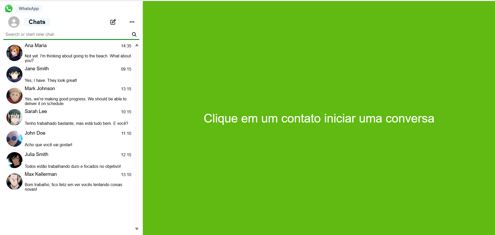
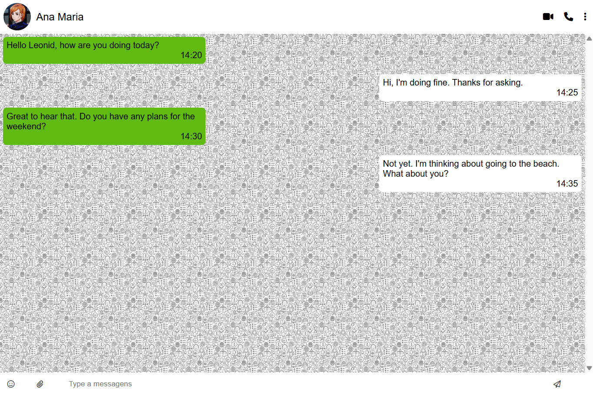
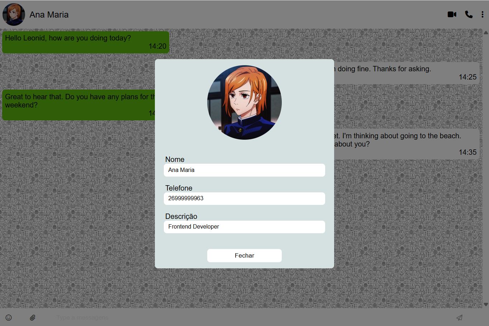

# what-zap-front-S2
## Sobre

O projeto consiste em desenvolver uma aplicação semelhante ao WhatsApp, cujo objetivo é colocar em prática os conhecimentos adquiridos na disciplina de Front-End.

## Descrição

Este projeto tem como propósito construir o front-end de um aplicativo similar ao WhatsApp, carregando usuários, contatos e mensagens fornecidas pelo back-end.

## Ressalva
O site não está muito responsivo e apresenta quebras devido aos tamanhos definidos para os elementos da tela.

## Tecnologias utilizadas

- **JavaScript**
- **HTML**
- **CSS**
## Imagem

- Login:
  

- Contatos:
  

- Mensagens:
  

- Informações do contato:
  

## Autor

**[Breno Oliveira Assis Reis](https://www.linkedin.com/in/breno-oliveira-assis-reis-203010351/)**.

